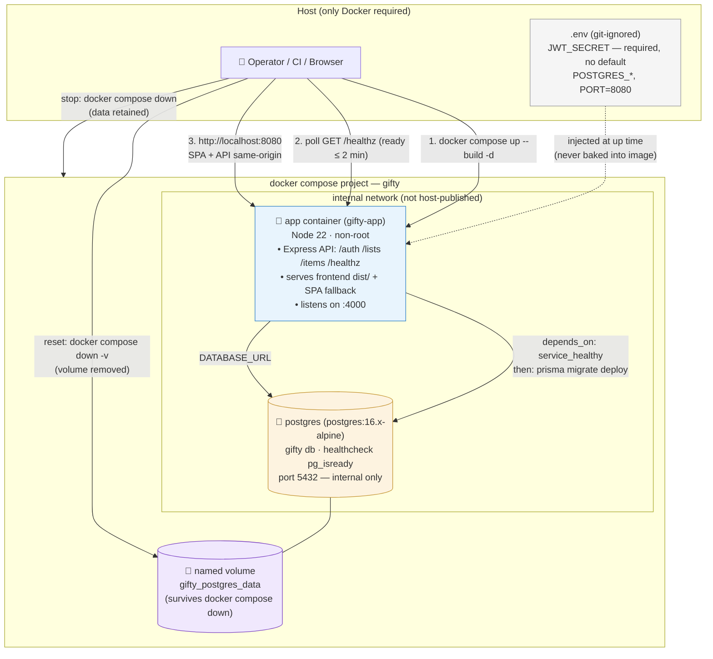

# Architecture Diagram: Docker Deployment

**Feature**: `002-docker-deployment` | **Date**: 2026-09-22

Visual reference for the two-container deployment described in `research.md` (D1/D2/D7), `contracts/deployment.md`, and `tasks.md`. Normative details live in those documents — this diagram is illustrative.

## What the diagram encodes

| Element | Contract / research ref |
|---------|-------------------------|
| Two containers (`app` + `postgres`) | research D1 |
| Single published port `8080→4000`; DB never host-published | research D7; contracts §2 (Constitution §I/§IV) |
| `app` image serves SPA + API (same origin) | research D1/D2/D12 |
| `depends_on: service_healthy` → `prisma migrate deploy` → serve | research D6/D11; contracts §4 |
| `gifty_postgres_data` named volume; `down` retains, `down -v` resets | research D5; contracts §1 (FR-004/008) |
| Secrets injected at `up` time, never baked into the image | research D4; contracts §3 (Constitution §IV) |
| `/healthz` readiness signal within 2 minutes | contracts §4 (FR-013, SC-001) |
